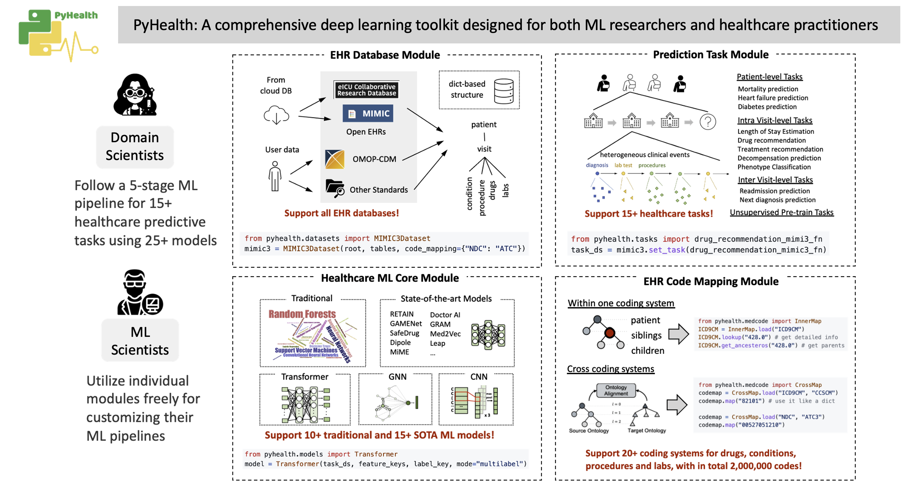
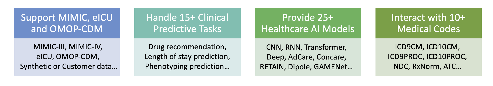
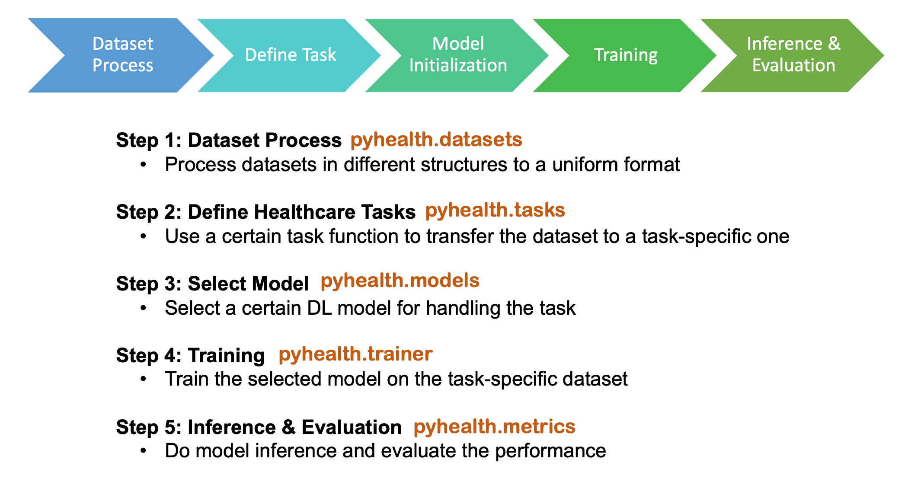
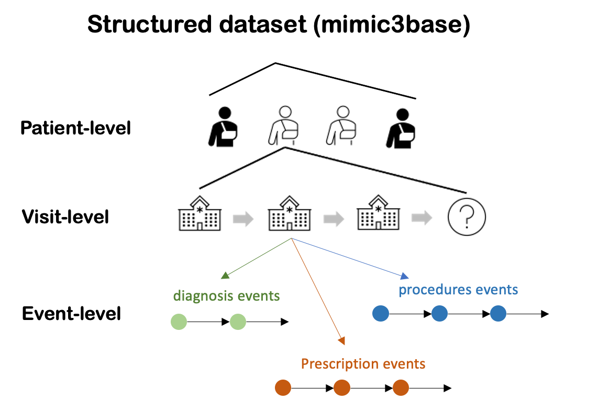

Welcome to PyHealth!
====================================

.. image:: https://img.shields.io/pypi/v/pyhealth.svg?color=brightgreen
   :target: https://pypi.org/project/pyhealth/
   :alt: PyPI version

.. image:: https://readthedocs.org/projects/pyhealth/badge/?version=latest
   :target: https://pyhealth.readthedocs.io/en/latest/
   :alt: Documentation status
   

.. image:: https://img.shields.io/github/stars/sunlabuiuc/pyhealth.svg
   :target: https://github.com/sunlabuiuc/pyhealth/stargazers
   :alt: GitHub stars

.. image:: https://img.shields.io/github/forks/sunlabuiuc/pyhealth.svg?color=blue
   :target: https://github.com/sunlabuiuc/pyhealth/network
   :alt: GitHub forks

.. image:: https://pepy.tech/badge/pyhealth
   :target: https://pepy.tech/project/pyhealth
   :alt: Downloads

.. image:: https://pepy.tech/badge/pyhealth/month
   :target: https://pepy.tech/project/pyhealth
   :alt: Downloads

.. -----

.. **Build Status & Coverage & Maintainability & License**

.. .. image:: https://travis-ci.org/yzhao062/pyhealth.svg?branch=master
..    :target: https://travis-ci.org/yzhao062/pyhealth
..    :alt: Build Status

.. .. image:: https://ci.appveyor.com/api/projects/status/1kupdy87etks5n3r/branch/master?svg=true
..    :target: https://ci.appveyor.com/project/yzhao062/pyhealth/branch/master
..    :alt: Build status

.. .. image:: https://api.codeclimate.com/v1/badges/bdc3d8d0454274c753c4/maintainability
..    :target: https://codeclimate.com/github/yzhao062/pyhealth/maintainability
..    :alt: Maintainability

.. .. image:: https://img.shields.io/github/license/yzhao062/pyhealth
..    :target: https://github.com/yzhao062/pyhealth/blob/master/LICENSE
..    :alt: License

PyHealth is designed for both **ML researchers and medical practitioners**. We can make your **healthcare AI applications** easier to deploy and more flexible and customizable. `[Tutorials] <https://pyhealth.readthedocs.io/>`_

 **[News!]** We are running the "PyHealth Live" gathering at 8 PM CST every Wednesday night! Welcome to join over `zoom <https://illinois.zoom.us/j/87450975602?pwd=ckQyaHhkRitlUzlwYUY3NjdEQ0pFdz09>`_. Check out `PyHealth Live <https://github.com/sunlabuiuc/PyHealth/blob/master/docs/live.rst>`_ for more information and watch the `Live Videos <https://www.youtube.com/playlist?list=PLR3CNIF8DDHJUl8RLhyOVpX_kT4bxulEV>`_.

..

1. Installation :rocket:
-----------------

- You could install from PyPi:

.. code-block:: sh

    pip install pyhealth

- or from github source:

.. code-block:: sh

    pip install .

2. Introduction :book:
--------------------------
``pyhealth`` provides these functionalities (we are still enriching some modules):

You can use the following functions independently:

- **Dataset**: ``MIMIC-III``, ``MIMIC-IV``, ``eICU``, ``OMOP-CDM``, ``customized EHR datasets``, etc.
- **Tasks**: ``diagnosis-based drug recommendation``, ``patient hospitalization and mortality prediction``, ``length stay forecasting``, etc. 
- **ML models**: ``CNN``, ``LSTM``, ``GRU``, ``LSTM``, ``RETAIN``, ``SafeDrug``, ``Deepr``, etc.

*Build a healthcare AI pipeline can be as short as 10 lines of code in PyHealth*.

3. Build ML Pipelines :trophy:
--------------------------

All healthcare tasks in our package follow a **five-stage pipeline**: 

..

 We try hard to make sure each stage is as separate as possibe, so that people can customize their own pipeline by only using our data processing steps or the ML models.

Module 1: <pyhealth.datasets>
""""""""""""""""""""""""""""""""""""

``pyhealth.datasets`` provides a clean structure for the dataset, independent from the tasks. We support `MIMIC-III`, `MIMIC-IV` and `eICU`, etc. The output (mimic3base) is a multi-level dictionary structure (see illustration below).

.. code-block:: python

    from pyhealth.datasets import MIMIC3Dataset

    mimic3base = MIMIC3Dataset(
        # root directory of the dataset
        root="https://storage.googleapis.com/pyhealth/Synthetic_MIMIC-III/", 
        # raw CSV table name
        tables=["DIAGNOSES_ICD", "PROCEDURES_ICD", "PRESCRIPTIONS"],
        # map all NDC codes to CCS codes in these tables
        code_mapping={"NDC": "CCSCM"},
    )

..

Module 2: <pyhealth.tasks>
""""""""""""""""""""""""""""""""""""

``pyhealth.tasks`` defines how to process each patient's data into a set of samples for the tasks. In the package, we provide several task examples, such as ``drug recommendation`` and ``length of stay prediction``. **It is easy to customize your own tasks following our** `template <https://colab.research.google.com/drive/1r7MYQR_5yCJGpK_9I9-A10HmpupZuIN-?usp=sharing>`_.

.. code-block:: python

    from pyhealth.tasks import readmission_prediction_mimic3_fn

    mimic3sample = mimic3base.set_task(task_fn=readmission_prediction_mimic3_fn) # use default task
    mimic3sample.samples[0] # show the information of the first sample
    """
    {
        'visit_id': '100183',
        'patient_id': '175',
        'conditions': ['5990', '4280', '2851', '4240', '2749', '9982', 'E8499', '42831', '34600'],
        'procedures': ['0040', '3931', '7769'],
        'drugs': ['N06DA02', 'V06DC01', 'B01AB01', 'A06AA02', 'R03AC02', 'H03AA01', 'J01FA09'],
        'label': 0
    }
    """

    from pyhealth.datasets import split_by_patient, get_dataloader

    train_ds, val_ds, test_ds = split_by_patient(mimic3sample, [0.8, 0.1, 0.1])
    train_loader = get_dataloader(train_ds, batch_size=32, shuffle=True)
    val_loader = get_dataloader(val_ds, batch_size=32, shuffle=False)
    test_loader = get_dataloader(test_ds, batch_size=32, shuffle=False)

Module 3: <pyhealth.models>
""""""""""""""""""""""""""""""""""""

``pyhealth.models`` provides different ML models with very similar argument configs.

.. code-block:: python

    from pyhealth.models import Transformer

    model = Transformer(
        dataset=mimic3sample,
        feature_keys=["conditions", "procedures", "drug"],
        label_key="label",
        mode="binary",
    )

Module 4: <pyhealth.trainer>
""""""""""""""""""""""""""""""""""""

``pyhealth.trainer`` can specify training arguemnts, such as epochs, optimizer, learning rate, etc. The trainer will automatically save the best model and output the path in the end.

.. code-block:: python
    
    from pyhealth.trainer import Trainer

    trainer = Trainer(model=model)
    trainer.train(
        train_dataloader=train_loader,
        val_dataloader=val_loader,
        epochs=50,
        monitor="pr_auc_samples",
    )

Module 5: <pyhealth.metrics>
""""""""""""""""""""""""""""""""""""

``pyhealth.metrics`` provides several **common evaluation metrics** (refer to `Doc <https://pyhealth.readthedocs.io/en/latest/api/metrics.html>`_ and see what are available).

.. code-block:: python

    # method 1
    trainer.evaluate(test_loader)
    
    # method 2
    from pyhealth.metrics.binary import binary_metrics_fn

    y_true, y_prob, loss = trainer.inference(test_loader)
    binary_metrics_fn(y_true, y_prob, metrics=["pr_auc", "roc_auc"])

4. Medical Code Map :hospital: 
------------------------

``pyhealth.codemap`` provides two core functionalities. **This module can be used independently.**

* For code ontology lookup within one medical coding system (e.g., name, category, sub-concept); 

.. code-block:: python

    from pyhealth.medcode import InnerMap

    icd9cm = InnerMap.load("ICD9CM")
    icd9cm.lookup("428.0")
    # `Congestive heart failure, unspecified`
    icd9cm.get_ancestors("428.0")
    # ['428', '420-429.99', '390-459.99', '001-999.99']
    
    atc = InnerMap.load("ATC")
    atc.lookup("M01AE51")
    # `ibuprofen, combinations`
    atc.lookup("M01AE51", "drugbank_id")
    # `DB01050`
    atc.lookup("M01AE51", "description")
    # Ibuprofen is a non-steroidal anti-inflammatory drug (NSAID) derived ...
    atc.lookup("M01AE51", "indication")
    # Ibuprofen is the most commonly used and prescribed NSAID. It is very common over the ...

* For code mapping between two coding systems (e.g., ICD9CM to CCSCM). 

.. code-block:: python

    from pyhealth.medcode import CrossMap

    codemap = CrossMap.load("ICD9CM", "CCSCM")
    codemap.map("428.0")
    # ['108']

    codemap = CrossMap.load("NDC", "RxNorm")
    codemap.map("50580049698")
    # ['209387']

    codemap = CrossMap.load("NDC", "ATC")
    codemap.map("50090539100")
    # ['A10AC04', 'A10AD04', 'A10AB04']

5. Medical Code Tokenizer :speech_balloon:
---------------------------------------------

``pyhealth.tokenizer`` is used for transformations between string-based tokens and integer-based indices, based on the overall token space. We provide flexible functions to tokenize 1D, 2D and 3D lists. **This module can be used independently.**

.. code-block:: python

    from pyhealth.tokenizer import Tokenizer

    # Example: we use a list of ATC3 code as the token
    token_space = ['A01A', 'A02A', 'A02B', 'A02X', 'A03A', 'A03B', 'A03C', 'A03D', \
            'A03F', 'A04A', 'A05A', 'A05B', 'A05C', 'A06A', 'A07A', 'A07B', 'A07C', \
            'A12B', 'A12C', 'A13A', 'A14A', 'A14B', 'A16A']
    tokenizer = Tokenizer(tokens=token_space, special_tokens=["<pad>", "<unk>"])

    # 2d encode 
    tokens = [['A03C', 'A03D', 'A03E', 'A03F'], ['A04A', 'B035', 'C129']]
    indices = tokenizer.batch_encode_2d(tokens) 
    # [[8, 9, 10, 11], [12, 1, 1, 0]]

    # 2d decode 
    indices = [[8, 9, 10, 11], [12, 1, 1, 0]]
    tokens = tokenizer.batch_decode_2d(indices)
    # [['A03C', 'A03D', 'A03E', 'A03F'], ['A04A', '<unk>', '<unk>']]

    # 3d encode
    tokens = [[['A03C', 'A03D', 'A03E', 'A03F'], ['A08A', 'A09A']], \
        [['A04A', 'B035', 'C129']]]
    indices = tokenizer.batch_encode_3d(tokens)
    # [[[8, 9, 10, 11], [24, 25, 0, 0]], [[12, 1, 1, 0], [0, 0, 0, 0]]]

    # 3d decode
    indices = [[[8, 9, 10, 11], [24, 25, 0, 0]], \
        [[12, 1, 1, 0], [0, 0, 0, 0]]]
    tokens = tokenizer.batch_decode_3d(indices)
    # [[['A03C', 'A03D', 'A03E', 'A03F'], ['A08A', 'A09A']], [['A04A', '<unk>', '<unk>']]]
..

6. Tutorials :teacher:
----------------------------

.. image:: https://colab.research.google.com/assets/colab-badge.svg
    :target: https://pyhealth.readthedocs.io/en/latest/tutorials.html

..

 We provide the following tutorials to help users get started with our pyhealth. 

`Tutorial 0: Introduction to pyhealth.data <https://colab.research.google.com/drive/1y9PawgSbyMbSSMw1dpfwtooH7qzOEYdN?usp=sharing>`_  `[Video] <https://www.youtube.com/watch?v=Nk1itBoLOX8&list=PLR3CNIF8DDHJUl8RLhyOVpX_kT4bxulEV&index=2>`_  

`Tutorial 1: Introduction to pyhealth.datasets <https://colab.research.google.com/drive/18kbzEQAj1FMs_J9rTGX8eCoxnWdx4Ltn?usp=sharing>`_  `[Video] <https://www.youtube.com/watch?v=c1InKqFJbsI&list=PLR3CNIF8DDHJUl8RLhyOVpX_kT4bxulEV&index=3>`_ 

`Tutorial 2: Introduction to pyhealth.tasks <https://colab.research.google.com/drive/1r7MYQR_5yCJGpK_9I9-A10HmpupZuIN-?usp=sharing>`_  `[Video] <https://www.youtube.com/watch?v=CxESe1gYWU4&list=PLR3CNIF8DDHJUl8RLhyOVpX_kT4bxulEV&index=4>`_ 

`Tutorial 3: Introduction to pyhealth.models <https://colab.research.google.com/drive/1LcXZlu7ZUuqepf269X3FhXuhHeRvaJX5?usp=sharing>`_  `[Video] <https://www.youtube.com/watch?v=fRc0ncbTgZA&list=PLR3CNIF8DDHJUl8RLhyOVpX_kT4bxulEV&index=6>`_ 

`Tutorial 4: Introduction to pyhealth.trainer <https://colab.research.google.com/drive/1L1Nz76cRNB7wTp5Pz_4Vp4N2eRZ9R6xl?usp=sharing>`_  `[Video] <https://www.youtube.com/watch?v=5Hyw3of5pO4&list=PLR3CNIF8DDHJUl8RLhyOVpX_kT4bxulEV&index=7>`_ 

`Tutorial 5: Introduction to pyhealth.metrics <https://colab.research.google.com/drive/1Mrs77EJ92HwMgDaElJ_CBXbi4iABZBeo?usp=sharing>`_  `[Video] <https://www.youtube.com/watch?v=d-Kx_xCwre4&list=PLR3CNIF8DDHJUl8RLhyOVpX_kT4bxulEV&index=8>`_

`Tutorial 6: Introduction to pyhealth.tokenizer <https://colab.research.google.com/drive/1bDOb0A5g0umBjtz8NIp4wqye7taJ03D0?usp=sharing>`_ `[Video] <https://www.youtube.com/watch?v=CeXJtf0lfs0&list=PLR3CNIF8DDHJUl8RLhyOVpX_kT4bxulEV&index=10>`_

`Tutorial 7: Introduction to pyhealth.medcode <https://colab.research.google.com/drive/1xrp_ACM2_Hg5Wxzj0SKKKgZfMY0WwEj3?usp=sharing>`_ `[Video] <https://www.youtube.com/watch?v=MmmfU6_xkYg&list=PLR3CNIF8DDHJUl8RLhyOVpX_kT4bxulEV&index=9>`_ 

 The following tutorials will help users build their own task pipelines.

`Pipeline 1: Drug Recommendation <https://colab.research.google.com/drive/10CSb4F4llYJvv42yTUiRmvSZdoEsbmFF?usp=sharing>`_ `[Video] <https://
www.youtube.com/watch?v=GGP3Dhfyisc&list=PLR3CNIF8DDHJUl8RLhyOVpX_kT4bxulEV&index=12>`_ 

`Pipeline 2: Length of Stay Prediction <https://colab.research.google.com/drive/1JoPpXqqB1_lGF1XscBOsDHMLtgvlOYI1?usp=sharing>`_ `[Video] <https://
www.youtube.com/watch?v=GGP3Dhfyisc&list=PLR3CNIF8DDHJUl8RLhyOVpX_kT4bxulEV&index=12>`_ 

`Pipeline 3: Readmission Prediction <https://colab.research.google.com/drive/1bhCwbXce1YFtVaQLsOt4FcyZJ1_my7Cs?usp=sharing>`_ `[Video] <https://
www.youtube.com/watch?v=GGP3Dhfyisc&list=PLR3CNIF8DDHJUl8RLhyOVpX_kT4bxulEV&index=12>`_ 

`Pipeline 4: Mortality Prediction <https://colab.research.google.com/drive/1Qblpcv4NWjrnADT66TjBcNwOe8x6wU4c?usp=sharing>`_ `[Video] <https://
www.youtube.com/watch?v=GGP3Dhfyisc&list=PLR3CNIF8DDHJUl8RLhyOVpX_kT4bxulEV&index=12>`_ 

 We provided the advanced tutorials for supporting various needs. 

`Advanced Tutorial 1: Fit your dataset into our pipeline <https://colab.research.google.com/drive/1UurxwAAov1bL_5OO3gQJ4gAa_paeJwJp?usp=sharing>`_  `[Video] <https://www.youtube.com/watch?v=xw2hGLEQ4Y0&list=PLR3CNIF8DDHJUl8RLhyOVpX_kT4bxulEV&index=13>`_

`Advanced Tutorial 2: Define your own healthcare task <https://colab.research.google.com/drive/1gK6zPXvfFGBM1uNaLP32BOKrnnJdqRq2?usp=sharing>`_ 

`Advanced Tutorial 3: Adopt customized model into pyhealth <https://colab.research.google.com/drive/1F_NJ90GC8_Eq-vKTf7Tyziew4gWjjKoH?usp=sharing>`_  `[Video] <https://www.youtube.com/watch?v=lADFlcmLtdE&list=PLR3CNIF8DDHJUl8RLhyOVpX_kT4bxulEV&index=14>`_

`Advanced Tutorial 4: Load your own processed data into pyhealth and try out our ML models <https://colab.research.google.com/drive/1ZRnKch2EyJLrI3G5AvDXVpeE2wwgBWfw?usp=sharing>`_ `[Video] <https://www.youtube.com/watch?v=xw2hGLEQ4Y0&list=PLR3CNIF8DDHJUl8RLhyOVpX_kT4bxulEV&index=13>`_

7. Datasets :mountain_snow:
--------------------------
We provide the processing files for the following open EHR datasets:

===================  =======================================  ========================================  ======================================================================================================== 
Dataset              Module                                   Year                                      Information                                                             
===================  =======================================  ========================================  ========================================================================================================
MIMIC-III            ``pyhealth.datasets.MIMIC3BaseDataset``  2016                                      `MIMIC-III Clinical Database <https://physionet.org/content/mimiciii/1.4//>`_    
MIMIC-IV             ``pyhealth.datasets.MIMIC4BaseDataset``  2020                                      `MIMIC-IV Clinical Database <https://physionet.org/content/mimiciv/0.4/>`_  
eICU                 ``pyhealth.datasets.eICUBaseDataset``    2018                                      `eICU Collaborative Research Database <https://eicu-crd.mit.edu//>`_                 
OMOP                 ``pyhealth.datasets.OMOPBaseDataset``                                              `OMOP-CDM schema based dataset <https://www.ohdsi.org/data-standardization/the-common-data-model/>`_                                    
===================  =======================================  ========================================  ========================================================================================================

8. Machine/Deep Learning Models and Benchmarks :airplane:
----------------------------------------------------------

==================================    ================  =================================  ======  ===========================================================================================================================================
Model Name                            Type              Module                             Year    Reference
==================================    ================  =================================  ======  ===========================================================================================================================================
Convolutional Neural Network (CNN)    deep learning     ``pyhealth.models.CNN``            1989    `Handwritten Digit Recognition with a Back-Propagation Network <https://proceedings.neurips.cc/paper/1989/file/53c3bce66e43be4f209556518c2fcb54-Paper.pdf>`_
Recurrent Neural Nets (RNN)           deep Learning     ``pyhealth.models.RNN``            2011    `Recurrent neural network based language model <http://www.fit.vutbr.cz/research/groups/speech/servite/2010/rnnlm_mikolov.pdf>`_
Transformer                           deep Learning     ``pyhealth.models.Transformer``    2017    `Atention is All you Need <https://arxiv.org/abs/1706.03762>`_
RETAIN                                deep Learning     ``pyhealth.models.RETAIN``         2016    `RETAIN: An Interpretable Predictive Model for Healthcare using Reverse Time Attention Mechanism <https://arxiv.org/abs/1608.05745>`_
GAMENet                               deep Learning     ``pyhealth.models.GAMENet``        2019    `GAMENet: Graph Attention Mechanism for Explainable Electronic Health Record Prediction <https://arxiv.org/abs/1809.01852>`_
MICRON                                deep Learning     ``pyhealth.models.MICRON``         2021    `Change Matters: Medication Change Prediction with Recurrent Residual Networks <https://www.ijcai.org/proceedings/2021/0513>`_
SafeDrug                              deep Learning     ``pyhealth.models.SafeDrug``       2021    `SafeDrug: Dual Molecular Graph Encoders for Recommending Effective and Safe Drug Combinations <https://arxiv.org/abs/2105.02711>`_
==================================    ================  =================================  ======  ===========================================================================================================================================

* Check the `interactive map on benchmark EHR predictive tasks <https://pyhealth.readthedocs.io/en/latest/index.html#benchmark-on-healthcare-tasks>`_.

9. Citing PyHealth :handshake:
----------------------------------

.. code-block:: bibtex

    @software{pyhealth2022github,
        author = {Chaoqi Yang and Zhenbang Wu and Patrick Jiang and Jimeng Sun},
        title = {{PyHealth}: A Deep Learning Toolkit for Healthcare Predictive Modeling},
        url = {https://github.com/sunlabuiuc/PyHealth},
        year = {2022},
    }

