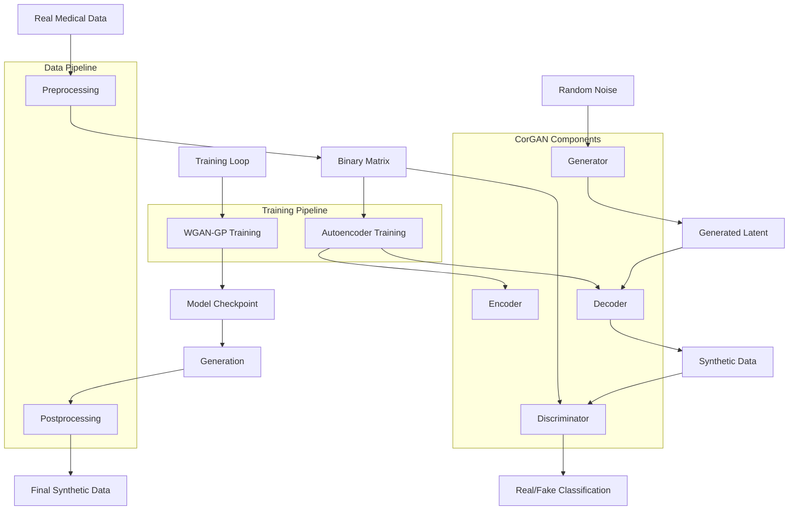

# CorGAN: Correlation-capturing Generative Adversarial Network

CorGAN is a novel framework that utilizes Convolutional Neural Networks to capture correlations between adjacent medical features in the data representation space by combining Convolutional Generative Adversarial Networks with Convolutional Autoencoders.

## Architecture Overview



## Key Components

### 1. Autoencoder
- **Encoder**: 1D convolutional layers with LeakyReLU and BatchNorm
- **Decoder**: Transposed 1D convolutions to reconstruct input
- **Purpose**: Learn meaningful latent representations of medical data

### 2. Generator
- **Input**: Random noise (latent_dim = 128)
- **Architecture**: MLP with residual connections
- **Output**: Latent representations that get decoded by autoencoder

### 3. Discriminator
- **Input**: Real or synthetic medical records
- **Architecture**: MLP with minibatch averaging
- **Output**: Real/fake classification

### 4. Training Process
1. **Pretraining**: Autoencoder learns to reconstruct real data
2. **Adversarial Training**: WGAN-GP with gradient penalty
3. **Generation**: Use trained generator + decoder to create synthetic data

## Data Flow

1. **Preprocessing**: Convert medical records to binary matrix
2. **Training**: 
   - Pretrain autoencoder (1 epoch)
   - Train GAN with WGAN-GP (1000 epochs)
3. **Generation**: Generate synthetic samples
4. **Postprocessing**: Convert back to medical codes

## Usage

```python
from pyhealth.models.generators import CorGAN
from pyhealth.datasets import MIMIC3Dataset

# Load dataset
dataset = MIMIC3Dataset(...)

# Initialize model
model = CorGAN(
    dataset=dataset,
    feature_keys=["conditions"],
    latent_dim=128,
    batch_size=512,
    n_epochs=1000
)

# Train model
model.fit()

# Generate synthetic data
synthetic_data = model.generate(n_samples=50000)
```

## Key Features

- **Correlation Capture**: Uses CNNs to capture feature correlations
- **WGAN-GP**: Wasserstein GAN with gradient penalty for stable training
- **Autoencoder Integration**: Combines GAN with autoencoder for better quality
- **Medical Data Specific**: Designed for binary medical records
- **PyHealth Integration**: Seamless integration with PyHealth ecosystem

## Implementation Details

- **Framework**: PyTorch
- **Architecture**: CNN-based autoencoder + MLP generator/discriminator
- **Loss Function**: WGAN-GP with gradient penalty
- **Optimizer**: Adam with learning rate 0.001
- **Batch Size**: 512 (configurable)
- **Latent Dimension**: 128 (configurable)

## References

- Original CorGAN Paper: "Correlation-capturing Generative Adversarial Network"
- Based on synthEHRella implementation
- Adapted for PyHealth framework 