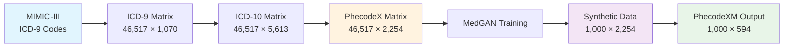
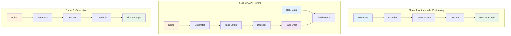

# MedGAN for Synthetic EHR Data Generation

This implementation provides a complete pipeline for generating synthetic Electronic Health Record (EHR) data using MedGAN, following the approach from the original research paper "Generating Multi-label Discrete Patient Records using Generative Adversarial Networks" by Choi et al. (2017).

## Overview

This module provides a comprehensive pipeline for:
- **Preprocessing**: Transforming MIMIC-III data through ICD-9 → ICD-10 → PhecodeX → PhecodeXM conversions
- **MedGAN Model**: GAN architecture with autoencoder pretraining for generating synthetic medical records
- **Postprocessing**: Converting synthetic data back to standardized PhecodeXM format (594 codes)

## Data Pipeline

### 1. Preprocessing Pipeline

The preprocessing follows a multi-stage transformation process:

#### Stage 1: MIMIC-III to ICD-9 Matrix
- **Input**: MIMIC-III DIAGNOSES_ICD table
- **Processing**: Extract ICD-9 codes and convert to 3-digit format (e.g., "250.01" → "250")
- **Output**: Binary matrix (patients × ICD-9 codes)
- **Shape**: Typically ~46,517 patients × ~1,070 ICD-9 codes

#### Stage 2: ICD-9 to ICD-10 Conversion
- **Mapping**: Uses official ICD-9 to ICD-10 crosswalk mappings
- **Process**: Each ICD-9 code maps to one or more ICD-10 codes
- **Output**: Binary matrix (patients × ICD-10 codes)
- **Shape**: ~46,517 patients × ~5,613 ICD-10 codes

#### Stage 3: ICD-10 to PhecodeX Conversion
- **Mapping**: Uses PhecodeX mappings (expanded phecode system)
- **Process**: Groups related ICD-10 codes into phenotypic categories
- **Output**: Binary matrix (patients × PhecodeX codes)
- **Shape**: ~46,517 patients × ~2,254 PhecodeX codes

#### Stage 4: PhecodeX to PhecodeXM Conversion (Postprocessing)
- **Mapping**: Uses PhecodeXM mappings (medical phecode system)
- **Process**: Further groups PhecodeX codes into medical categories
- **Output**: Binary matrix (patients × PhecodeXM codes)
- **Shape**: ~46,517 patients × 594 PhecodeXM codes

### Data Pipeline Visualization



### 2. MedGAN Architecture

The MedGAN model consists of three main components:

#### Autoencoder
- **Purpose**: Pretrains to learn meaningful representations of sparse binary data
- **Architecture**: 
  - Encoder: Dense layers with ReLU activation
  - Decoder: Dense layers with Sigmoid activation
- **Loss**: Binary cross-entropy
- **Pretraining**: 100+ epochs before GAN training

#### Generator
- **Input**: Random noise (latent_dim = 128)
- **Architecture**: Dense layers with batch normalization and ReLU
- **Output**: Latent representations for autoencoder decoder
- **Purpose**: Generate fake patient representations

#### Discriminator
- **Input**: Real or synthetic patient data
- **Architecture**: Dense layers with minibatch averaging
- **Output**: Binary classification (real vs fake)
- **Purpose**: Distinguish between real and synthetic data

### MedGAN Architecture Visualization




### 4. Postprocessing Pipeline

After generating synthetic data, the pipeline converts it back through the mapping chain:

#### Step 1: Synthetic PhecodeX → PhecodeXM
- **Input**: Synthetic matrix (patients × 2,254 PhecodeX codes)
- **Process**: Apply PhecodeX to PhecodeXM mappings
- **Output**: Synthetic matrix (patients × 594 PhecodeXM codes)

#### Step 2: Binarization
- **Threshold**: 0.5 (values ≥ 0.5 become 1, others become 0)
- **Result**: Binary synthetic patient records

## Usage

### Basic Training

```bash
# Train with phecode mapping (recommended)
python examples/synthetic_data_generation_mimic3_medgan.py \
    --data_path /path/to/mimic3 \
    --use_phecode_mapping \
    --postprocess \
    --autoencoder_epochs 100 \
    --gan_epochs 1000 \
    --batch_size 128
```

## Components

### PhecodeDataset (`pyhealth/datasets/phecode_dataset.py`)
- **PhecodeTransformer**: Handles ICD-9 → ICD-10 → PhecodeX conversions
- **PhecodeDataset**: Main dataset class for preprocessing
- **PhecodeMatrixDataset**: PyTorch dataset wrapper for training

### MedGAN Model (`pyhealth/models/generators/medgan.py`)
- **MedGAN**: Main model class with autoencoder, generator, and discriminator
- **Training methods**: Pretraining and GAN training loops
- **Generation methods**: Sample generation and transformation

### Mapping Files (`pyhealth/datasets/phecode_mappings/`)
- **ICD9toICD10Mapping.json**: ICD-9 to ICD-10 crosswalk
- **icd10_to_phecodex_mapping.json**: ICD-10 to PhecodeX mappings
- **phecodex_to_phecodexm_mapping.json**: PhecodeX to PhecodeXM mappings
- **phecodexm_types.json**: Final 594 PhecodeXM code definitions

### Example Scripts
- **`examples/synthetic_data_generation_mimic3_medgan.py`**: Main training script with phecode mapping

## Output Files

After training, the pipeline produces:

- **`phecode_matrix.npy`**: Preprocessed PhecodeX matrix (2,254 codes)
- **`synthetic_binary_matrix.npy`**: Raw synthetic data
- **`synthetic_phecodexm_matrix.npy`**: Final postprocessed data (594 codes)
- **`synthetic_phecodexm.csv`**: CSV format for compatibility
- **`medgan_final.pth`**: Trained model checkpoint
- **`loss_history.npy`**: Training loss curves

## Shape Differences

| Stage | Matrix Shape | Code Count | Description |
|-------|-------------|------------|-------------|
| ICD-9 | (46,517, 1,070) | 1,070 | Raw MIMIC-III ICD-9 codes |
| ICD-10 | (46,517, 5,613) | 5,613 | Expanded ICD-10 codes |
| PhecodeX | (46,517, 2,254) | 2,254 | Phenotypic groupings |
| PhecodeXM | (46,517, 594) | 594 | Medical categories |

## Notes

- **Sparsity**: Medical data is highly sparse (~98.5% zeros)
- **Stability**: Minibatch averaging helps prevent mode collapse
- **Privacy**: Synthetic data preserves statistical properties while protecting privacy
- **Compatibility**: Output format matches synthEHRella for easy integration
