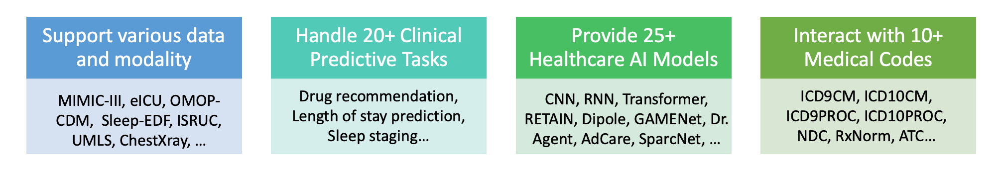

PyHealth is designed for both **ML researchers and medical practitioners**. We can make your **healthcare AI applications** easier to deploy and reproduce. Your development process becomes more flexible and more customizable.

```
pip install pyhealth
```

## 1. Introduction
``pyhealth`` provides these functionalities:



Users can use the following functions independently in their workflow:

- **Dataset**: ``MIMIC``, ``eICU``, ``OMOP-CDM``, ``Sleep-EDF``, ``Chest X-ray``, ``ISURC``, etc.
- **Tasks**: ``diagnosis-based drug recommendation``, ``patient hospitalization and mortality prediction``, ``sleep staging``, ``chest disease classificatio``, ``EEG event detection`` etc. 
- **ML models**: ``CNN``, ``LSTM``, ``GRU``, ``LSTM``, ``RETAIN``, ``SafeDrug``, ``Deepr``, ``SparcNet``, ``ContraWR``, ``GAMENet``, etc.

*Build a healthcare AI pipeline can be as short as 10 lines of code in PyHealth*.


## 2. Build ML Pipelines

All healthcare tasks in PyHealth follow a **five-stage pipeline**: 


We try hard to ensure these modules are independent, so users can customize their own pipeline by only using one or two components of PyHealth on need, such as using data processing steps or borrowing the ML models.


## 3. Medical Code Map

``pyhealth.codemap`` provides two core functionalities.

* For code ontology lookup within one medical coding system (e.g., name, category, sub-concept); 

```python
from pyhealth.medcode import InnerMap

icd9cm = InnerMap.load("ICD9CM")
icd9cm.lookup("428.0")
# `Congestive heart failure, unspecified`

atc = InnerMap.load("ATC")
atc.lookup("M01AE51") # `ibuprofen, combinations`
atc.lookup("M01AE51", "description")
# Ibuprofen is a non-steroidal anti-inflammatory drug (NSAID) derived ...
```

* For code mapping between two coding systems (e.g., ICD9CM to CCSCM). 

```python
from pyhealth.medcode import CrossMap

codemap = CrossMap.load("ICD9CM", "CCSCM")
codemap.map("428.0") # ['108']
```

## 4. KDD Tutorial Schedule
Check out the slides and colab notebooks on [Google Drive](https://drive.google.com/drive/folders/10SRErhMgmwIvBwafp_YmaZEziOhYTaYk?usp=sharing) during the tutorial.

### 4.1 Overview of PyHealth (15 min) 
- [[Slides]](https://docs.google.com/presentation/d/1Bf2YD7-uOtVKLR1k0jeOLyjnf751bvb8/edit?usp=drive_link&ouid=114056280947748046947&rtpof=true&sd=true)
- Background and motivations.
- Key features of PyHealth.
- Useful resources of PyHealth.

It is worth noting that PyHealth follows a five-stage pipeline (dataset process, task process, load ML model, train, and evaluation) for all data modalities below.

### 4.2 Clinical Predictive Modeling with EHRs (30 min) 
- [[Slides]](https://docs.google.com/presentation/d/1Bf2YD7-uOtVKLR1k0jeOLyjnf751bvb8/edit?usp=drive_link&ouid=114056280947748046947&rtpof=true&sd=true) [[Notebook]](https://colab.research.google.com/drive/1RzNWEb2Y-YWS1S1rjN5z0GndU5RP3y-B?usp=drive_link)
We will use slides as well as colab notebooks to present.
- Supported EHR datasets: MIMIC-III, MIMIC-IV, eICU, OMOP-CDM.
- Supported EHR tasks: readmissiong prediction, mortality prediction, diagnosis-based drug recommendation, etc.
- Supported EHR models: RETAIN, SafeDrug, MoleRec, Deepr, GAMENet, MICRON, ConCare, AdaCare, Agent, etc.
- Demo: We will use the RETAIN model for length of stay prediction task on MIMIC-III dataset (open the notebook to practice).

### 4.3 Deep Learning for Physiological Signals (20 min) 
- [[Slides]](https://docs.google.com/presentation/d/1Bf2YD7-uOtVKLR1k0jeOLyjnf751bvb8/edit?usp=drive_link&ouid=114056280947748046947&rtpof=true&sd=true) [[Notebook]](https://colab.research.google.com/drive/1pIhfyasmLveCh2QaTz4zhlW_6IKZtYfS?usp=drive_link)
We will use slides as well as colab notebooks to present.
- Supported biosignal datasets: ISRUC, Cardiology, Sleep-EDF, SHHS, TUEV, TUAB, etc.
- Supported biosignal tasks: sleep staging, EEG event detection, abnormal EEG detection, arrythmia detection, etc.
- Supported EHR models: ContraWR, SPaRCNet, ST-Transformer, etc.
- Demo: We will use the ContraWR model for sleep staging task on Sleep-EDF dataset (open the notebook to practice).

### 4.4 PyHealth for medical imaging (20 min) 
- [[Slides]](https://docs.google.com/presentation/d/15MRyNz7Dx5dtQN4PR-DDJ4GR9dhPk0xT/edit?usp=drive_link&ouid=114056280947748046947&rtpof=true&sd=true) [[Notebook]](https://colab.research.google.com/drive/1dNh2wGM-gVMciUpJQihxFg4hGV1xzLI9?ouid=114056280947748046947&usp=drive_link)
We will use slides as well as colab notebooks to present.
- Overview of medical image datasets supported by PyHealth, such as CheXpert, RSNA, COVID, and MIMIC-CXR.
- Overview of tasks supported by PyHealth, such as x-ray representation learning, chest disease classification, medical report generation.
- Introduce existing models in PyHealth.
- Demonstrate the chest disease classification on the COVID dataset using ResNet.

### 4.5 PyHealth for biomedical text mining (20 min) 
- [[Slides]](https://docs.google.com/presentation/d/1ztPNlsDTgsP8Kpd3S_VQ8_UuMDuAUXtJ/edit?usp=drive_link&ouid=114056280947748046947&rtpof=true&sd=true) [[Notebook]](https://colab.research.google.com/drive/11tOVJpNUpQbw-rTutCXvtZY12tksEL6Q?ouid=114056280947748046947&usp=drive_link)
We will use slides as well as colab notebooks to present.
- Overview of medical text datasets supported by PyHealth, such as MIMIC-III clinical notes, MIMIC-CXR, and IU-XRay.
- Overview of tasks supported by PyHealth, such as clinical notes classification and medical report generation.
- Introduce existing models in PyHealth.
- Demonstrate on radiology reports generation from x-ray images.

### 4.6 PyHealth pre-trained embedding (30 min) 
- [[Slides]](https://docs.google.com/presentation/d/1zO9jw7g2A7Bbuk7id6xvi7bg2WdWXIbd/edit?usp=drive_link&ouid=114056280947748046947&rtpof=true&sd=true) [[Notebook]](https://colab.research.google.com/drive/1_wHjYq91Rqa_7c8uIZnwT_KOvQLZrzyg?ouid=114056280947748046947&usp=drive_link)
We will use slides as well as colab notebooks to present.
- Overview of the medical knowledge base, including the supported medical coding systems, code mappings, and 
- Medical concept lookup.
- Medical code mapping.
- Pre-trained medical concepte embeddings.
- Demo: Leveraing the UMLS knowledge graph embedding to improve drug recommendation task on the MIMIC-III dataset.

### 4.7 Synthetic Electronic Medical Record Generation using Language Models (30 min) 
- [[Slides]](https://docs.google.com/presentation/d/1dqP8gpC0oOD8y5g9WrClTYEoLZiI5bC9/edit?usp=drive_link&ouid=114056280947748046947&rtpof=true&sd=true) [[Notebook]](https://colab.research.google.com/drive/12fGLkKgGSSHvgaMwrqrCLMKlgRNflqZ0?usp=drive_link)
We will use slides as well as colab notebooks to present.
- Introduction to basic concepts behind using Hierarchical Autoregressive Language Model (HALO) for synthesizing longitudinal medical records.
- Introduction to PyHealth interface for practically implementing HALO training.
- Demo: Apply PyHealth HALO API to PhysioNet eICU inpatient dataset to generate synthetic medical records.

### 4.8 PyHealth uncertainty quantification and model calibration (30 min) 
- [[Slides]](https://docs.google.com/presentation/d/1kuEmGZoYwLrzl26v3iIHgTMZnNE2v6Qq/edit?usp=drive_link&ouid=114056280947748046947&rtpof=true&sd=true) [[Notebook]](https://colab.research.google.com/drive/1yOMoklsP4ciwEvsEYY4zNMAUVh3iufeE?ouid=114056280947748046947&usp=drive_link)
We will use slides as well as colab notebooks to present.
- Introduction of basic concepts and common post-hoc tasks in uncertainty quantification, such as model calibration,  prediction set construction and prediction interval construction. 
- How to perform such tasks on arbitrary PyHealth models, after the training is done (which is why this is post-hoc).
- (Demo 1) We will use Temperature Scaling, Historgram Binning, and Kernel-based Calibration to calibrate a trained SPaRCNet, used for sleep staging task on the ISRUC dataset. (show some plots to let user understand the concepts)
- (Demo 2) We will use conformal prediction (LABEL) to construct prediction set with guarantee on the mis-coverage risk, again on a trained SPaRCNet on sleep staing task with the ISRUC dataset. 

### 4.9 Conclusion (10 min)
- A brief summary of the benefits of using PyHealth.
- Future development plans for PyHealth.
- A call for contributions from the community.
- Useful resources for PyHealth users.

## 5. PyHealth Tutors




