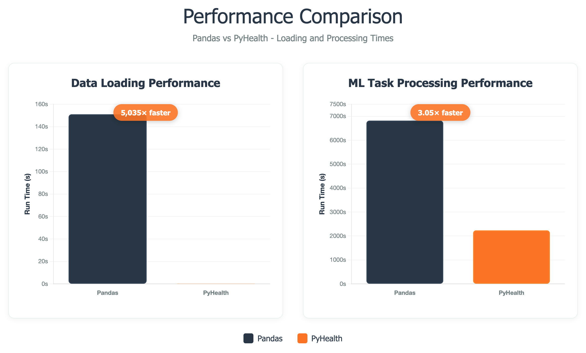

.. _why_pyhealth:

================
Why PyHealth?
================

PyHealth is the comprehensive Python library for healthcare AI that makes building, testing, and deploying healthcare machine learning models easier than ever before. Whether you're a researcher, data scientist, or healthcare practitioner, PyHealth provides the tools you need to develop robust healthcare AI applications.

🚀 **Build healthcare AI pipelines in just 10 lines of code**

Key Advantages
==============

🏗️ **Modular & Flexible Architecture**
--------------------------------------

PyHealth's 5-stage pipeline design allows you to:

- **Mix and match components**: Use only the parts you need
- **Easy customization**: Adapt any stage to your specific requirements  
- **Rapid prototyping**: Test different models and configurations quickly
- **Production ready**: Scale from research to deployment seamlessly
- **High performance**: Near-instant dataset loading and ~3x faster processing than pandas baselines

.. code-block:: text

    load dataset → define task → build model → train → evaluate
         ↓            ↓           ↓         ↓        ↓
    Your data → Your task → Your model → Auto → Results

🏥 **Healthcare-Specific Design**
--------------------------------

Unlike general ML libraries, PyHealth is built specifically for healthcare:

- **Medical code handling**: Built-in support for ICD, CPT, NDC, ATC, and more
- **Healthcare datasets**: Native support for MIMIC-III/IV, eICU, OMOP-CDM
- **Clinical metrics**: Healthcare-specific evaluation metrics (DDI rate, clinical accuracy)
- **Temporal modeling**: Handle complex patient timelines and visit sequences
- **Safety considerations**: Tools for model calibration and uncertainty quantification

🔬 **State-of-the-Art Models**
-----------------------------

Access cutting-edge healthcare AI models without complex implementation:

- **33+ pre-built models** from recent research papers
- **Easy benchmarking** across different approaches
- **Custom model layers** for building novel architectures
- **Interpretable models** like RETAIN for clinical decision support

📊 **Rich Dataset Ecosystem**
----------------------------

Work with the most important healthcare datasets out of the box:

.. table:: **Supported Datasets**
   :widths: auto

   ===================  ========================================  =======================================
   Dataset              Information                               Year
   ===================  ========================================  =======================================
   **MIMIC-III**        Critical care database (40K+ patients)   2016
   **MIMIC-IV**         Updated critical care database (300k+ patients)            2020  
   **eICU**             Multi-center ICU database                 2018
   **OMOP-CDM**         Standardized healthcare data format      Ongoing
   **EHRShot**          Few-shot EHR benchmarking dataset        2023
   **COVID19-CXR**      COVID-19 chest X-ray image dataset       2020
   **SleepEDF**         Sleep study recordings                    2018
   **SHHS**             Sleep Heart Health Study                  2016
   **ISRUC**            Sleep disorder database                   2016
   ===================  ========================================  =======================================

🤖 **Comprehensive Model Library**
==================================

PyHealth includes implementations of the most important healthcare AI models:

**Deep Learning Models**
-----------------------

.. table:: **Neural Network Models**
   :widths: auto

   ============================  ======  ================================================================
   Model                         Year    Key Innovation
   ============================  ======  ================================================================
   **RETAIN**                    2016    Interpretable attention for clinical decisions
   **GAMENet**                   2019    Memory networks for drug recommendation  
   **SafeDrug**                  2021    Molecular graphs for safe drug combinations
   **MoleRec**                   2023    Substructure-aware drug recommendation
   **AdaCare**                   2020    Scale-adaptive feature extraction
   **ConCare**                   2020    Transformer-based patient modeling
   **StageNet**                  2020    Disease progression stage modeling
   **GRASP**                     2021    Graph neural networks for patient clustering
   ============================  ======  ================================================================

**Foundation Models**
--------------------

.. table:: **General Purpose Models**
   :widths: auto

   ============================  ======  ================================================================
   Model                         Year    Description
   ============================  ======  ================================================================
   **Transformer**               2017    Attention-based sequence modeling
   **RNN/LSTM/GRU**              2011    Recurrent neural networks for sequences
   **CNN**                       1989    Convolutional networks for structured data
   **TCN**                       2018    Temporal convolutional networks
   **MLP**                       1986    Multi-layer perceptrons for tabular data
   ============================  ======  ================================================================

**Specialized Models**
---------------------

.. table:: **Domain-Specific Models**
   :widths: auto

   ============================  ======  ================================================================
   Model                         Year    Specialization
   ============================  ======  ================================================================
   **ContraWR**                  2021    Biosignal analysis (EEG, ECG)
   **SparcNet**                  2023    Seizure detection and sleep staging
   **Deepr**                     2017    Electronic health records
   **Dr. Agent**                 2020    Reinforcement learning for clinical decisions
   ============================  ======  ================================================================

🎯 **Common Use Cases**
======================

PyHealth excels at these healthcare AI applications:

**Clinical Prediction**
----------------------
- **Mortality prediction**: ICU and hospital mortality risk
- **Readmission prediction**: 30-day readmission risk
- **Length of stay**: Hospital and ICU stay duration
- **Disease progression**: Track patient condition changes

**Drug & Treatment Recommendation**
----------------------------------
- **Medication recommendation**: Suggest appropriate drugs
- **Drug-drug interaction**: Identify dangerous combinations  
- **Treatment optimization**: Personalized therapy selection
- **Dosage prediction**: Optimal medication dosing

**Medical Coding & Standards**
-----------------------------
- **Code translation**: Convert between ICD, CPT, NDC, ATC systems
- **Code completion**: Auto-suggest medical codes
- **Standardization**: Normalize medical terminology
- **Quality assurance**: Validate coding accuracy

**Biosignal Analysis**
---------------------
- **Sleep staging**: Automatic sleep phase classification
- **Seizure detection**: EEG abnormality identification
- **Cardiac monitoring**: ECG analysis and arrhythmia detection
- **Vital sign prediction**: Forecast patient deterioration

⚡ **Processing Performance**
============================

.. note::
   PyHealth uses optimized data loaders and vectorized operations to achieve near-instant dataset loading and preprocessing. In our internal benchmarks, end-to-end processing throughput is roughly **3x faster** than typical pandas-centric baselines on common healthcare workloads.

📈 **Growing Community**
=======================

Join thousands of healthcare AI practitioners:

- **Active Development**: Regular updates with new models and features
- **Research Collaboration**: Direct connection to academic research
- **Industry Partnerships**: Integration with healthcare organizations  
- **Open Source**: Transparent, auditable, and customizable
- **Documentation**: Comprehensive guides and tutorials
- **Support**: Active Discord community and GitHub discussions
  - `Join our Discord <https://discord.gg/mpb835EHaX>`_

🚀 **Get Started Today**
=======================

Ready to build your first healthcare AI application? See :doc:`how_to_get_started` to install PyHealth and build your first model in minutes.

.. seealso::
   
   - :doc:`how_to_get_started` - Build your first model in minutes
   - :doc:`install` - Installation instructions
   - :doc:`tutorials` - Interactive tutorials and examples
   - :doc:`api/models` - Complete model documentation
