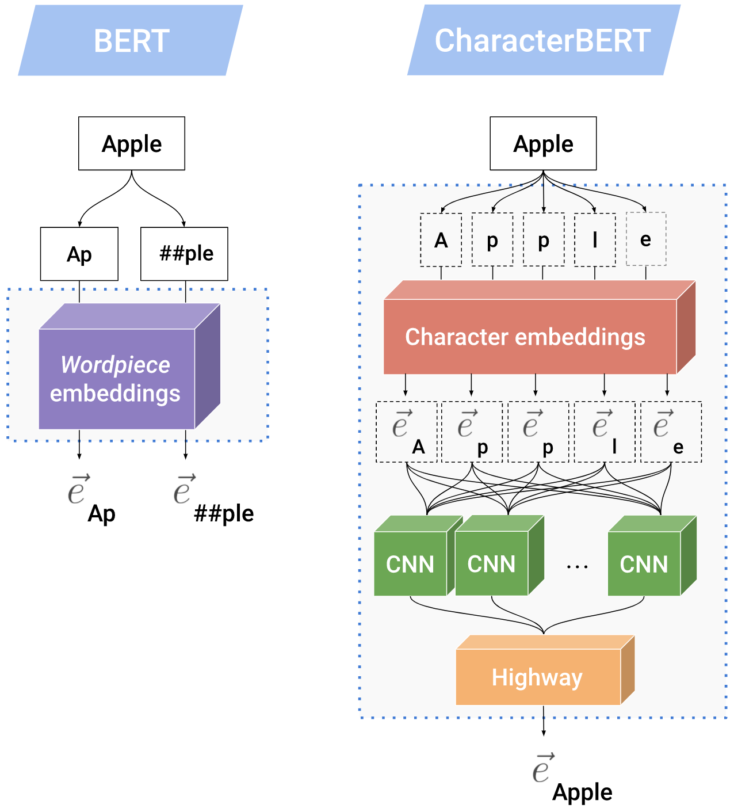
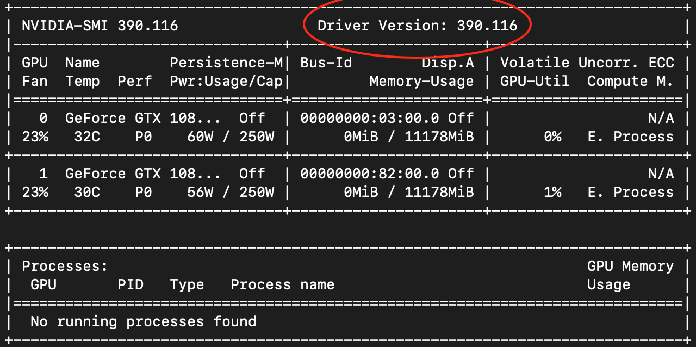
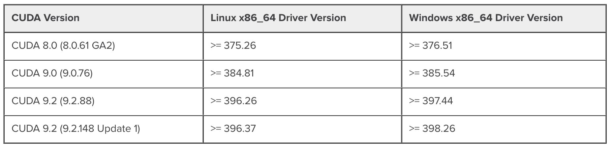

# CharacterBERT

[paper]: https://arxiv.org/abs/2010.10392

This is the repository of the paper "[CharacterBERT: Reconciling ELMo and BERT for Word-LevelOpen-Vocabulary Representations From Characters][paper]" that is soon to appear at COLING 2020.

## Table of contents

- [Paper summary](#paper-summary)
  - [TL;DR](#tldr)
  - [Motivations](#motivations)
- [How do I use CharacterBERT?](#how-do-i-use-characterbert)
  - [Installation](#installation)
  - [Pre-trained models](#pre-trained-models)
  - [Using CharacterBERT in practice](#using-characterbert-in-practice)
- [How do I pre-train CharacterBERT?](#how-do-i-pre-train-characterbert)
- [How do I reproduce the paper's results?](#how-do-i-reproduce-the-papers-results)
- [Running experiments on GPUs](#running-experiments-on-gpus)

## Paper summary

### TL;DR

CharacterBERT is a variant of [BERT](https://arxiv.org/abs/1810.04805) that produces **word-level contextual representations** by attending to the characters of each input token. To achieve that, instead of relying on a matrix of pre-defined wordpieces, it uses a [CharacterCNN](link-to-charcnn) module similar to [ELMo](https://arxiv.org/abs/1802.05365) to produce representations for arbitrary tokens. Besides this difference, CharacterBERT's architecture is identical BERT's.

<div style="text-align:center">
    <br>
    
</div>
The figure above shows the way context-independent representations are built in BERT and CharacterBERT. Here, we suppose that "Apple" is an unknown token and see that BERT splits it into two wordpieces "Ap" and "##ple" before embedding each unit. On the other hand, CharacterBERT receives the token "Apple" as is then attends to its characters to produce a single token embedding.

## Motivations

CharacterBERT has two main motivations:

- In more and more cases, the original BERT is adapted to new domains (e.g. medical domain) by re-training it on specialized corpora. In these cases, the original (general domain) wordpiece vocabulary is kept despite the model being actually used on a different domain, which seemed suboptimal (see _Section 2_ of the paper). A naive solution would be to train a new BERT from scratch with a specialized wordpiece vocabulary, but training a single BERT is costly let alone training one for each and every domain of interest.

- BERT uses a wordpiece system as a good compromise between the specificity of tokens and generality of characters. However, working with subwords is not very convenient in practice (Should we average the representations to get the original token embedding for word similarity tasks ? Should we only use the first wordpiece of each token in sequence labelling tasks ? ...)

Inspired by ELMo, we use a CharacterCNN module and manage to get a variant of BERT that produces word-level contextual representations and can be re-adapted on any domain without needing to worry about the suitability of any wordpieces. Moreover, attending to the characters of input tokens also allows us to achieve superior robustness to noise (see _Section 5.5_ of the paper).

## How do I use CharacterBERT?

### Installation

We recommend using a virtual environment that is specific to using CharacterBERT.

If you do not already have `conda` installed, you can install Miniconda from [this link](https://docs.conda.io/en/latest/miniconda.html#linux-installers) (~450Mb). Then, check that conda is up to date:

```bash
conda update -n base -c defaults conda
```

And create a fresh conda environment (~220Mb):

```bash
conda create python=3.8 --name=character-bert
```

If not already activated, activate the new conda environment using:

```bash
conda activate character-bert
```

Then install the following packages (~3Gb):

```bash
conda install pytorch torchvision cudatoolkit=10.2 -c pytorch
pip install transformers==3.3.1 scikit-learn==0.23.2
```

> Note 1: If you will not be running experiments on a GPU, install pyTorch via this command instead `conda install pytorch torchvision cpuonly -c pytorch`

> Note 2: If you just want to be able to load pre-trained CharacterBERT weigths, you do not have to install `scikit-learn` which is only used for computing Precision, Recall, F1 metrics during evaluation.

### Pre-trained models

You can use the `download.py` script to download any of the models below:

| Keyword                | Model description                                                                                                                                                                                                                                                         |
| ---------------------- | ------------------------------------------------------------------------------------------------------------------------------------------------------------------------------------------------------------------------------------------------------------------------- |
| general_character_bert | General Domain CharacterBERT pre-trained from scratch on English Wikipedia and [OpenWebText](https://skylion007.github.io/OpenWebTextCorpus/).                                                                                                                            |
| medical_character_bert | Medical Domain CharacterBERT initialized from **general_character_bert** then further pre-trained on [MIMIC-III](https://physionet.org/content/mimiciii/1.4/) clinical notes and [PMC OA](https://www.ncbi.nlm.nih.gov/pmc/tools/openftlist/) biomedical paper abstracts. |
| general_bert           | General Domain BERT pre-trained from scratch on English Wikipedia and [OpenWebText](https://skylion007.github.io/OpenWebTextCorpus/). <sup>1</sup>                                                                                                                        |
| medical_bert           | Medical Domain BERT initialized from **general_bert** then further pre-trained on [MIMIC-III](https://physionet.org/content/mimiciii/1.4/) clinical notes and [PMC OA](https://www.ncbi.nlm.nih.gov/pmc/tools/openftlist/) biomedical paper abstracts. <sup>2</sup>       |
| bert-base-uncased      | The original General Domain [BERT (base, uncased)](https://github.com/google-research/bert#pre-trained-models)                                                                                                                                                                                                                          |

> <sup>1, 2</sup> <small>We pre-train BERT models as well so that we can fairly compare each CharacterBERT model to it's BERT counterpart. Our BERT models use the same architecture and vocabulary as `bert-base-uncased`.</small><br>

For example, to download the medical version of CharacterBERT you can run:

```bash
python download.py --model='medical_character_bert'
```

Or you can download all models by running:

```bash
python download.py --model='all'
```

### Using CharacterBERT in practice

CharacterBERT's architecture is almost identical to BERT, so you can easilly adapt any code that uses the [Transformers](https://github.com/huggingface/transformers) library.

```python
""" Basic example: using CharacterBERT for binary classification """
from transformers import BertForSequenceClassification, BertConfig
from modeling.character_bert import CharacterBertModel

#### LOADING BERT FOR CLASSIFICATION ####

config = BertConfig.from_pretrained('bert-base-uncased', num_labels=2)  # binary classification
model = BertForSequenceClassification(config=config)

model.bert.embeddings.word_embeddings  # wordpiece embeddings
>>> Embedding(30522, 768, padding_idx=0)

#### REPLACING BERT WITH CHARACTER_BERT ####

character_bert_model = CharacterBertModel.from_pretrained(
    './pretrained-models/medical_character_bert/')
model.bert = character_bert_model

model.bert.embeddings.word_embeddings  # wordpieces are replaced with a CharacterCNN
>>> CharacterCNN(
        (char_conv_0): Conv1d(16, 32, kernel_size=(1,), stride=(1,))
        (char_conv_1): Conv1d(16, 32, kernel_size=(2,), stride=(1,))
        (char_conv_2): Conv1d(16, 64, kernel_size=(3,), stride=(1,))
        (char_conv_3): Conv1d(16, 128, kernel_size=(4,), stride=(1,))
        (char_conv_4): Conv1d(16, 256, kernel_size=(5,), stride=(1,))
        (char_conv_5): Conv1d(16, 512, kernel_size=(6,), stride=(1,))
        (char_conv_6): Conv1d(16, 1024, kernel_size=(7,), stride=(1,))
        (_highways): Highway(
        (_layers): ModuleList(
            (0): Linear(in_features=2048, out_features=4096, bias=True)
            (1): Linear(in_features=2048, out_features=4096, bias=True)
        )
        )
        (_projection): Linear(in_features=2048, out_features=768, bias=True)
    )

#### PREPARING RAW TEXT ####

from transformers import BertTokenizer
from utils.character_cnn import CharacterIndexer

text = "CharacterBERT attends to each token's characters"
bert_tokenizer = BertTokenizer.from_pretrained('bert-base-uncased')
tokenized_text = bert_tokenizer.basic_tokenizer.tokenize(text) # this is NOT wordpiece tokenization

tokenized_text
>>> ['characterbert', 'attends', 'to', 'each', 'token', "'", 's', 'characters']

indexer = CharacterIndexer()  # This converts each token into a list of character indices
input_tensor = indexer.as_padded_tensor([tokenized_text])  # we build a batch of only one sequence
input_tensor.shape
>>> torch.Size([1, 8, 50])  # (batch_size, sequence_length, character_embedding_dim)

#### USING CHARACTER_BERT FOR INFERENCE ####

output = model(input_tensor)[0]
>>> tensor([[-0.3378, -0.2772]], grad_fn=<AddmmBackward>)  # class logits
```

For more complete (but still illustrative) examples you can refer to the `run_experiments.sh` script which runs a few Classification/SequenceLabelling experiments using BERT/CharacterBERT.

```bash
bash run_experiments.sh
```

You can adapt the `run_experiments.sh` script to try out any available model. You should also be able to add real classification and sequence labelling tasks by adapting the `data.py` script.

## How do I pre-train CharacterBERT?

Please refer to the following repository: <https://github.com/helboukkouri/character-bert-pretraining>

## How do I reproduce the paper's results?

Please refer to the following repository: <https://github.com/helboukkouri/character-bert-finetuning>

## Running experiments on GPUs

In order to use GPUs you will need to make sure the PyTorch version that is in your conda environment matches your machine's configuration. To do that, you may want to run a few tests.

Let's assume you want to use the GPU n°0 on your machine. Then set:

```bash
export CUDA_VISIBLE_DEVICES=0
```

And run these commands to check whether pytorch can detect your GPU:

```python
import torch
print(torch.cuda.is_available())  # Should return `True`
```

If the last command returns `False`, then there is probably a mismatch between the installed PyTorch version and your machine's configuration. To fix that, run `nvidia-smi` in your terminal and check your driver version:

<center></center>

Then compare this version with the numbers given in the [NVIDIA CUDA Toolkit Release Notes](https://docs.nvidia.com/cuda/cuda-toolkit-release-notes/index.html):

<center></center>

In this example the shown version is `390.116` which corresponds to `CUDA 9.0`. This means that the appropriate command for installing PyTorch is:

```bash
conda install pytorch torchvision cudatoolkit=9.0 -c pytorch
```

Now, everything should work fine!
